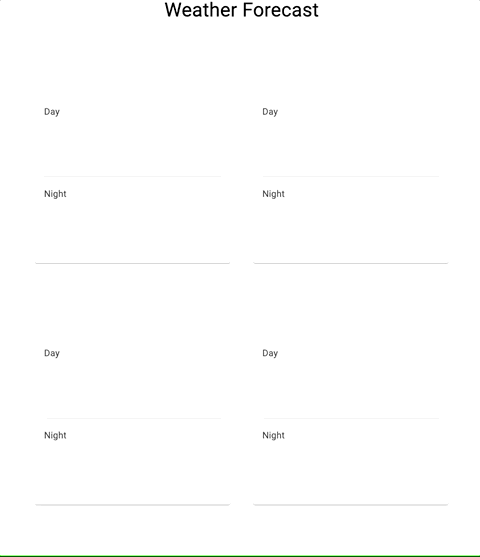

# Problem Statement
There is an XML weather API accessible from [Ilmateenistus](http://www.ilmateenistus.ee/ilma_andmed/xml/forecast.php?lang=eng).

Build a [Spring-Boot](https://spring.io/guides) based web-application (single page) that consumes the API
and displays a relevant weather forecast to the user in a human-readable format.

## Notes
* What info to show and how to solve the UI is up to you — as long as the user gets relevant weather info.
* No limitations are set on the front-end framework, so use whatever framework you want and design the page however you see fit.
* The application should use Gradle as the build environment and should be easy to compile and run.
* After building the application, please send us the source code for evaluation.

# Results

## Demo

Implemented a fairly basic SSE-based solution.

## Attributions
* Front-end spun up with [Create React App](https://github.com/facebook/create-react-app);
* Front-end uses [Material UI](https://material-ui.com);
* Weather icons provided by [react-icons-react](https://github.com/najens/weather-icons-react);
* Web service boilerplate generated with [Spring Initializr](https://start.spring.io);
* Web service built on [Spring WebFlux](https://docs.spring.io/spring-framework/docs/5.0.0.BUILD-SNAPSHOT/spring-framework-reference/html/web-reactive.html).

## Instructions

If you have access to IntelliJ IDEA, simply import the gradle project and run the entry point class.

Otherwise, `./gradlew bootJar` will generate a runnable JAR file for you.

Run the JAR and access [index.html](http://localhost:8080/index.html).
